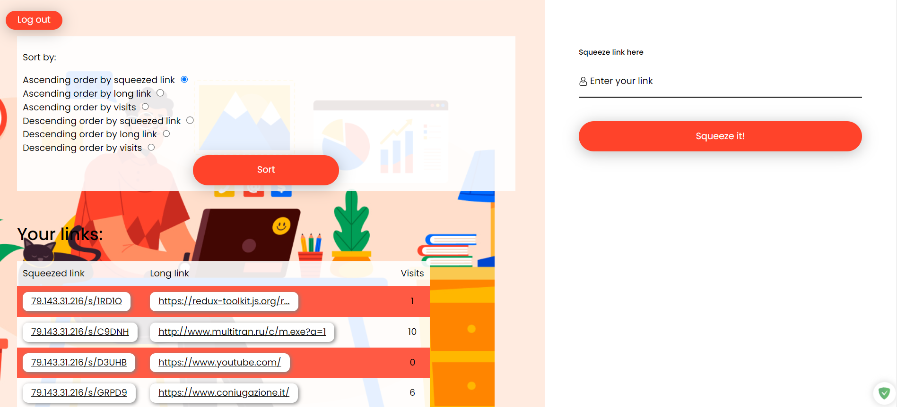

<h1 align="center">squeeze your link!</h1>

## What is this web application for? 🚀

This application is a service for link shortening. You can short a link and see all your statistics. Adaptive design is available.

You need to authorize to use this service.

Backend by `http://79.143.31.216/docs#/`

## Features 💡

- Login and register
- Short pasted link
- Get statistics of all your links
- Check number of visits of a shorted link
- Sort the statistics table

## Technologies ⚒

- Javascript ES6
- React
- Redux (including RTK)
- React Router
- React Cookie
- BEM
- CSS5
- SASS
- HTML5

## Setting up development environment 📍

- `git clone https://github.com/varflam/short_link_service.git`
- `npm install`
- `npm start`
- App should now be running on `http://localhost:3000/`
